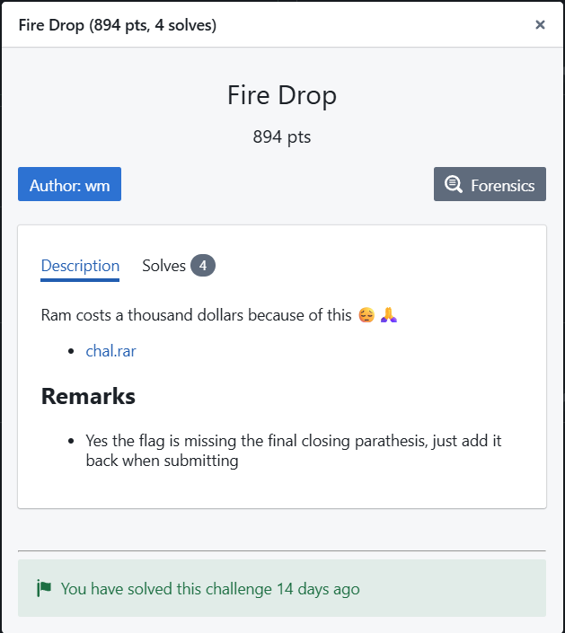
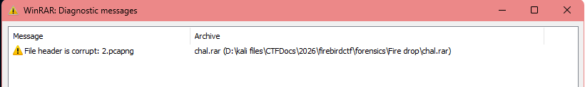
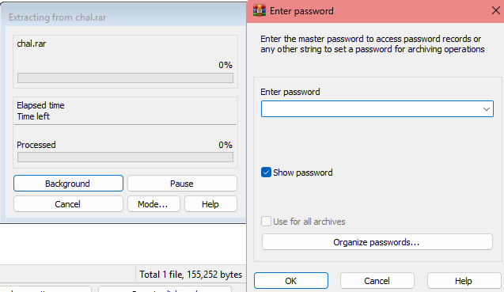

# Fire Drop
Difficulty: ★★★★★★★★★☆	&emsp;&emsp;&emsp;&emsp;&emsp;&emsp; Solved by: codestube (youstube_)  
  

## Details:
- Author: wm
- Category: Forensics
- Score acquired: 894 (4 Solves)

## Description:
> Ram costs a thousand dollars because of this :pensive: :pray:
> - [chal.rar](<files/chal.rar>)
> # Remarks:
> - Yes the flag is missing the final closing parathesis, just add it back when submitting

## Write up:
First off, sorry for writing this so late. I'm so chopped for that. Secondly, I still hate this challenge after 2 weeks. Let's get started.  
We were given a rar-zipped file[ `chal.rar`](files/chal.rar). When we try to open it, we see there is a 2.pcapng inside, but the header is corrupted..?  
  

My first assumption would be to perhaps fix the header of it, and work my way through the file, but extracting the file required a password... or does it?  

## My understanding:
WIP
## My Solution:
WIP
## Conclusion:
WIP
## Shoutout:
- WIP

 

	Tags: WIP
