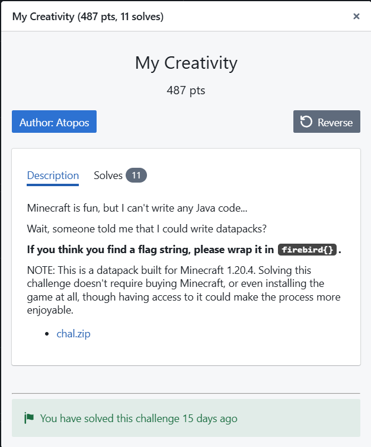

# My Creativity
Difficulty: ★★★★★★★☆☆☆	&emsp;&emsp;&emsp;&emsp;&emsp;&emsp; Solved by: codestube (youstube_)  
  

## Details:
- Author: Atopos
- Category: Reverse
- Score acquired: 487 (11 Solves)

## Description:
> Minecraft is fun, but I can't write any Java code...  
> Wait, someone told me that I could write datapacks?  
> **If you think you find a flag string, please wrap it in `firebird{}`.**  

> NOTE: This is a datapack built for Minecraft 1.20.4. Solving this challenge doesn't require buying Minecraft, or even installing the game at all, though having access to it could make the process more enjoyable.
> - [chal.zip](<files/chal.zip>)

## Write up:
WIP
## My understanding:
WIP
## My Solution:
WIP
## Conclusion:
WIP
## Shoutout:
- WIP

 

	Tags: WIP
