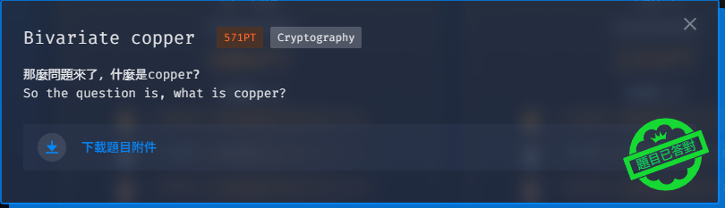
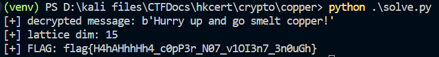

# Bivariate copper
Difficulty: ★☆☆☆☆☆☆☆☆☆	&emsp;&emsp;&emsp;&emsp;&emsp;&emsp; Solved by: codestube (youstube_)  
  

## Details:
- Author: ~~Not mentioned~~
- Category: Cryptography
- Score acquired: 571 (16 solves in Tertiary)

## Description:
> 那麼問題來了，什麼是copper？

> So the question is, what is copper?

>

## Write up:
TBH this is gonna be the most disappointing writeup I've ever written.
## My understanding:
I only understand this is the [Coppersmith's attack](https://en.wikipedia.org/wiki/Coppersmith%27s_attack) from the `copper` hint. And naturally I don't do crypto, so... [yeah](https://chatgpt.com/share/694a231d-b4c8-800b-a648-dc09323b1c0d)... It only took a bit over 50 minutes but...
## My Solution:  
Yea... [click here to view the script](files/solve.py) I totally wrote and understand on my own...  

## Conclusion:
I still need to learn crypto xd
## Shoutout:
- HKCERT (Organizer)
- ChatGPT (Goat at Crypto)
- Crypto Lord (idk)

 

	Tags: Crypto, Coppersmith, RSA, HKCERT, ChatGPT
