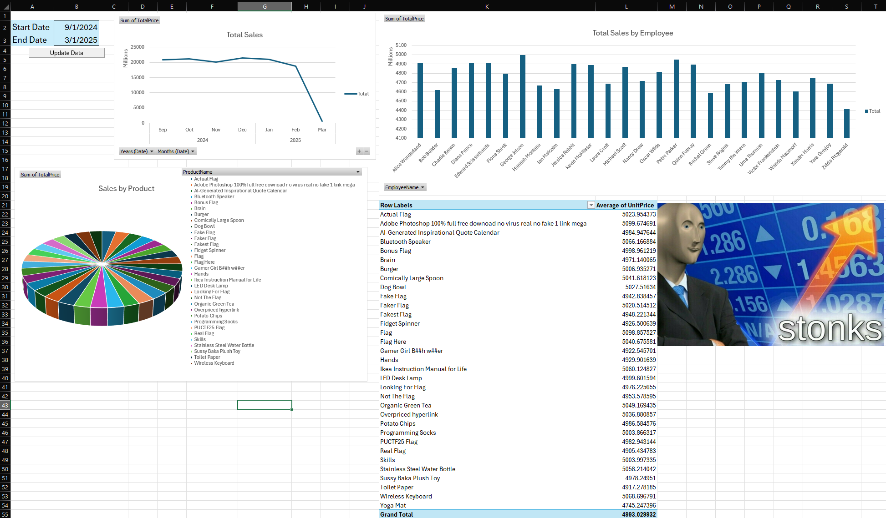
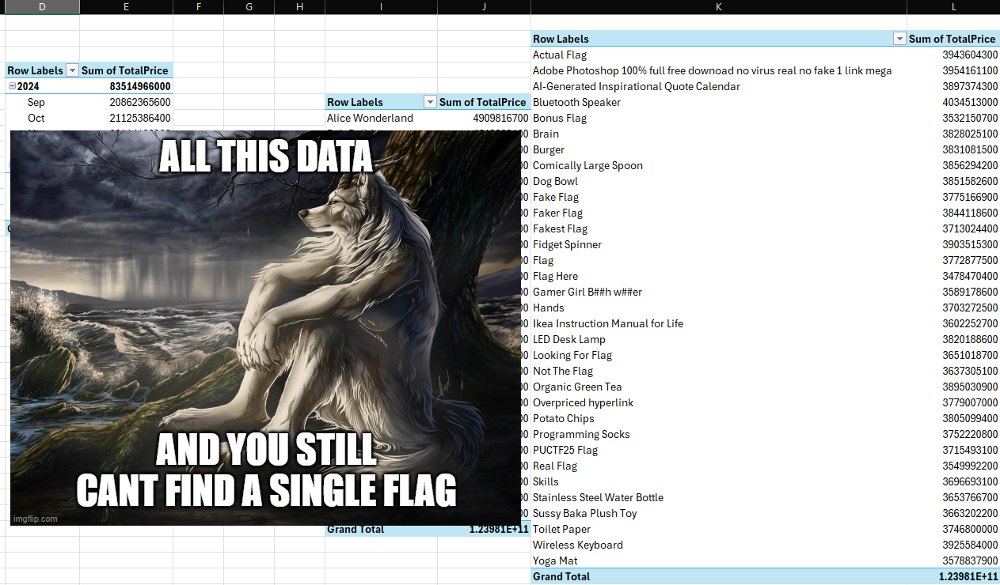
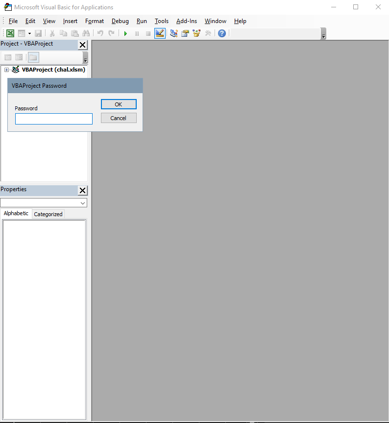

# Business Intelligence - Write up
Difficulty: ★★★☆☆☆☆☆☆☆	&emsp;&emsp;&emsp;&emsp;&emsp;&emsp;&emsp;&emsp;&emsp;&emsp;&emsp;&emsp;&emsp;&emsp; Solved by: codestube (youstube_)  

## Details:
* Author: Jomapisa
* Category: Miscellaneous
* Score acquired: 399
## Description:
>Business is booming! let's see what insights we can get from all this data.
>
>[chal.xlsm](files/chal.xlsm)

## Write up:
When I first open this excel spreadsheet, I see <b>stonks</b>. <sub>ba dum tss</sub>  
  
I looked around the spreadsheet, moving pictures, saw these fake flags, some of which were kinda fun.
* PUCTF25{ch4tgpt_c0mpet1t0r}
* PUCTF25{d33p_s33k_w4s_h3r3}
* PUCTF25{bruteforce_me_daddy}PUCTF25{THIS_IS_A_FAKE_FLAG} << this is just weird..

Lastly, looked at the **aux** sheet. Nothing much here.  
  

However, I wanted to go back on the button in the Dashboard page, and see what does it do.  
  
Hmm, that's definitely weird..  
So I actually went out my way and enabling VBA macros in my excel, just so I can get to the bottom of it

  
> DISCLAIMER: DO NOT ENABLE THIS UNLESS YOU KNOW THE FILE IS ABSOLUTELY SAFE.

However, Excel still blocked my action. So I REALLY wanted to know what this macro really does.  
I right clicked Dashboard &rarr; View Code..  
  
A password? Of all places you could've put one, it is in the one blocking the macro script?  
Looks like it's something important <sub>heheh- *cough*</sub>
## My Solution:
Since the VBAProject is locked behind password, we can:
1. Look for password inside the Excel Spreadsheet, or;
2. Just remove the password /shrug

So, I googled for a script / tool to remove VBA's password. and [this came up.](https://trumpexcel.com/excel-vba/remove-password/)
<details>
<summary>Click to toggle code</summary>

```
Private Const PAGE_EXECUTE_READWRITE = &H40 
Private Declare PtrSafe Sub MoveMemory Lib "kernel32" Alias "RtlMoveMemory" _  
	(Destination As LongPtr, Source As LongPtr, ByVal Length As LongPtr) 
Private Declare PtrSafe Function VirtualProtect Lib "kernel32" (lpAddress As LongPtr, _  
	ByVal dwSize As LongPtr, ByVal flNewProtect As LongPtr, lpflOldProtect As LongPtr) As LongPtr 
Private Declare PtrSafe Function GetModuleHandleA Lib "kernel32" (ByVal lpModuleName As String) As LongPtr 
Private Declare PtrSafe Function GetProcAddress Lib "kernel32" (ByVal hModule As LongPtr, _  
	ByVal lpProcName As String) As LongPtr 
Private Declare PtrSafe Function DialogBoxParam Lib "user32" Alias "DialogBoxParamA" (ByVal hInstance As LongPtr, _  
	ByVal pTemplateName As LongPtr,	ByVal hWndParent As LongPtr, _  
	ByVal lpDialogFunc As LongPtr, ByVal dwInitParam As LongPtr) As Integer 
Dim HookBytes(0 To 11) As Byte 
Dim OriginBytes(0 To 11) As Byte 
Dim pFunc As LongPtr 
Dim Flag As Boolean 
Private Function GetPtr(ByVal Value As LongPtr) As LongPtr 
GetPtr = Value 
End Function 
Public Sub RecoverBytes() 
If Flag Then MoveMemory ByVal pFunc, ByVal VarPtr(OriginBytes(0)), 12
End Sub 
Public Function Hook() As Boolean 
	Dim TmpBytes(0 To 11) As Byte 
	Dim p As LongPtr, osi As Byte 
	Dim OriginProtect As LongPtr 
	Hook = False 

	#If Win64 Then 
		osi = 1 
	#Else 
		osi = 0 
	#End If 
	pFunc = GetProcAddress(GetModuleHandleA("user32.dll"), "DialogBoxParamA") 
	If VirtualProtect(ByVal pFunc, 12, PAGE_EXECUTE_READWRITE, OriginProtect) <> 0 Then
		MoveMemory ByVal VarPtr(TmpBytes(0)), ByVal pFunc, osi + 1 
		If TmpBytes(osi) <> &HB8 Then 
			MoveMemory ByVal VarPtr(OriginBytes(0)), ByVal pFunc, 12 
			p = GetPtr(AddressOf MyDialogBoxParam) 
			If osi Then HookBytes(0) = &H48 
			HookBytes(osi) = &HB8 
			osi = osi + 1 
			MoveMemory ByVal VarPtr(HookBytes(osi)), ByVal VarPtr(p), 4 * osi 
			HookBytes(osi + 4 * osi) = &HFF 
			HookBytes(osi + 4 * osi + 1) = &HE0 
			MoveMemory ByVal pFunc, ByVal VarPtr(HookBytes(0)), 12 
			Flag = True 
			Hook = True 
		End If 
	End If 
End Function 

Private Function MyDialogBoxParam(ByVal hInstance As LongPtr, _ 
	ByVal pTemplateName As LongPtr, ByVal hWndParent As LongPtr, _ 
	ByVal lpDialogFunc As LongPtr, ByVal dwInitParam As LongPtr) As Integer 
	If pTemplateName = 4070 Then 
		MyDialogBoxParam = 1 
	Else 
		RecoverBytes 
		MyDialogBoxParam = DialogBoxParam(hInstance, pTemplateName, _  
		hWndParent, lpDialogFunc, dwInitParam) 
	Hook 
	End If 
End Function 

Sub UnprotectVBA() 
	If Hook Then 
		MsgBox "VBA Project is unprotected!", vbInformation, "VBA Unlocked" 
	End If 
End Sub
```
</details>

> Disclaimer: Do not run random script from the internet if you don't know what it does.

This script basically listens for the prompt of password when trying to open chal.xlsm's VBAProject. When Office pop up a password dialog `DialogBoxParamA`, it hooks the function, intercept the request and return 1 (which means success), cracking open the VBAProject.  
  
So I opened a new Excel spreadsheet (Ctrl + N) &rarr; Went to view code &rarr; Inserted a new module &rarr; Pasted this code &rarr; Run it, and voila!  
  
And now, we have the code for the macro!
<details>
<summary>Click to toggle code</summary>

```
Sub GetData()
    ' Declare variables
    Dim wsData As Worksheet
    Dim wsDashboard As Worksheet
    Dim startDate As String
    Dim endDate As String
    Dim connectionString As String
    Dim commandText As String
    Dim WB As Workbook
    Dim dateCol As ListColumn
    Dim i As Integer
    
    ' Get reference to workbook and worksheets
    Set WB = ThisWorkbook
    On Error Resume Next
    Set wsData = WB.Worksheets("Data")
    Set wsDashboard = WB.Worksheets("Dashboard")
    
    If wsData Is Nothing Then
        Set wsData = WB.Worksheets.Add
        wsData.Name = "Data"
    End If
    
    If wsDashboard Is Nothing Then
        MsgBox "Dashboard sheet not found!", vbCritical
        Exit Sub
    End If
    On Error GoTo 0
    
    ' Get date range from Dashboard sheet
    startDate = Format(wsDashboard.Range("B2").Value, "yyyy-mm-dd")
    endDate = Format(wsDashboard.Range("B3").Value, "yyyy-mm-dd")
    
    ' Validate dates
    If IsDate(startDate) = False Or IsDate(endDate) = False Then
        MsgBox "Invalid date format in the Dashboard sheet!", vbCritical
        Exit Sub
    End If
    
    ' PROPER CLEANUP SECTION - Clean up any existing tables and queries
    Application.DisplayAlerts = False ' Suppress delete confirmations
    
    ' Remove all existing ListObjects (Tables)
    On Error Resume Next
    Do While wsData.ListObjects.Count > 0
        wsData.ListObjects(1).Delete
    Loop
    
    ' Remove all existing QueryTables
    Do While wsData.QueryTables.Count > 0
        wsData.QueryTables(1).Delete
    Loop
    
    ' Clear the worksheet
    wsData.Cells.Clear
    
    Application.DisplayAlerts = True ' Restore alerts
    On Error GoTo ErrorHandler
    
    ' Create connection strings
    connectionString = "ODBC;DRIVER=SQL Server;SERVER=chal.polyuctf.com,51337;DATABASE=NuttyERP;UID=Nutty_Executive;PWD=NuttExec03172025;"
    commandText = "SELECT * FROM sales WHERE Date >= '" & startDate & "' AND Date <= '" & endDate & "'"
    
    ' Create the query table using ODBC connection
    With wsData.QueryTables.Add(Connection:=connectionString, Destination:=wsData.Range("A1"))
        .commandText = commandText
        .Name = "NuttyERP_Sales"
        .RowNumbers = False
        .FillAdjacentFormulas = False
        .PreserveFormatting = True
        .RefreshOnFileOpen = False
        .BackgroundQuery = True
        .RefreshStyle = xlInsertDeleteCells
        .SavePassword = True
        .SaveData = True
        .AdjustColumnWidth = True
        .RefreshPeriod = 0
        .PreserveColumnInfo = True
        
        ' Execute the query and refresh the data
        .Refresh BackgroundQuery:=False
    End With
    
    ' If data was retrieved successfully, convert to Excel table
    If wsData.UsedRange.Rows.Count > 1 Then
        ' Define the range for the table
        Dim dataRange As Range
        Set dataRange = wsData.Range("A1").CurrentRegion
        
        ' Create a table from the data (but not a QueryTable this time)
        Dim tbl As ListObject
        Set tbl = wsData.ListObjects.Add(xlSrcRange, dataRange, , xlYes)
        tbl.Name = "SalesData"
        
        ' Apply a table style
        tbl.TableStyle = "TableStyleMedium2"
        
        ' Format date column(s)
        On Error Resume Next
        ' First try to find a column named exactly "Date"
        Set dateCol = tbl.ListColumns("Date")
        
        ' If not found, look for columns with "date" in their name
        If dateCol Is Nothing Then
            For i = 1 To tbl.ListColumns.Count
                If InStr(1, tbl.ListColumns(i).Name, "date", vbTextCompare) > 0 Then
                    Set dateCol = tbl.ListColumns(i)
                    Exit For
                End If
            Next i
        End If
        
        ' Format the date column if found
        If Not dateCol Is Nothing Then
            ' Convert text to dates if needed
            Dim cell As Range
            For Each cell In dateCol.DataBodyRange
                If Not IsEmpty(cell.Value) Then
                    If IsDate(cell.Value) Then
                        cell.Value = CDate(cell.Value)
                    End If
                End If
            Next cell
            
            ' Use Excel's built-in short date format
            dateCol.DataBodyRange.NumberFormat = "m/d/yyyy"
        End If
        On Error GoTo ErrorHandler
        
        ' Auto-fit columns
        wsData.UsedRange.EntireColumn.AutoFit
        
        MsgBox "Data successfully retrieved and formatted as a table in the Data sheet.", vbInformation
    Else
        MsgBox "No data found for the specified date range.", vbInformation
    End If
    
    Exit Sub
    
ErrorHandler:
    MsgBox "Error: " & Err.Description, vbCritical
    
    ' Clean up if error occurs
    On Error Resume Next
    Application.DisplayAlerts = False
    If wsData.QueryTables.Count > 0 Then
        wsData.QueryTables(1).Delete
    End If
    Application.DisplayAlerts = True
End Sub
```
</details>  
Well, hello. You. <sub>(Sorry I was watching the new season of You on netflix.) </sub> <br>

```
connectionString = "ODBC;DRIVER=SQL Server;SERVER=chal.polyuctf.com,51337;DATABASE=NuttyERP;UID=Nutty_Executive;PWD=NuttExec03172025;"
```
Looks like we hit the jackpot. Now all we have to do is to access this SQL database server locally.  
I'll be using Azure Data Studio, but feel free to use any Database Management Tool you'd prefer.  
I'll click on `New connection`, select `SQL Login` and input the details given from the code line.  
  
Now when we connect, we should see 5 tables, with 1 of it being special. `secret`  
 
So, we'll just make a simple SQL query,  
`select * from secret`  
Ladies and gentlemen, we got 'em.  
  
The flag is `PUCTF25{H4rD_C0d3D_CR3d3Nt14l5_Mu5T_h4v3_B33n_Th3_1Nt3rN_f8060c2a1d041f414eff8a60a5db1846}`
## Conclusion
This was really fun to say the least, realizing that VBA module can be so easily broken into with a script to copy and paste made me more aware that many things are simply a google search away, and I'm glad that all my time learning SQL query didn't go to waste after all. This was also my very first >300 solve on not just this CTF, but on my first ever CTF participated. So I'm really glad that I actually got the flag and happy that I can solve puzzles from online CTFs. A huge confidence boost to say the least. :>

## Shoutout
- NuttyShell (The Organizers)
- Jomapisa (The author)
- Google (cuz google.)
- Teammates (For participating with me)  
 
 
 
 
 
  
<sub>
	Tags: Excel, VBA, password, SQL, Database, Spreadsheet, PUCTF, 2025
</sub>
