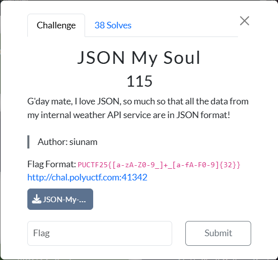
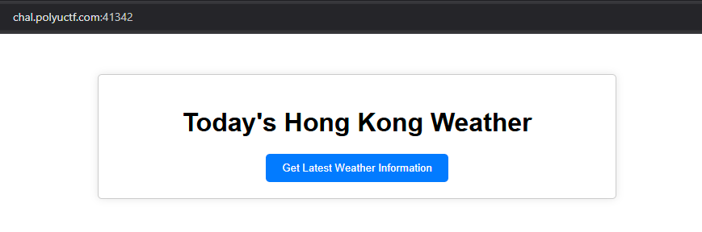
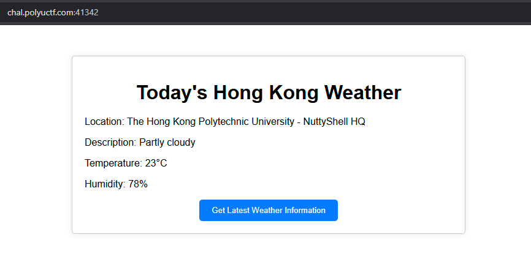
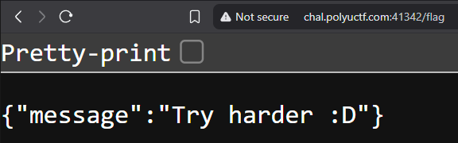
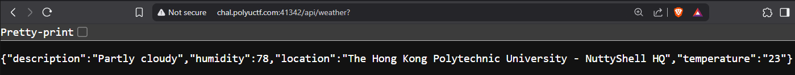
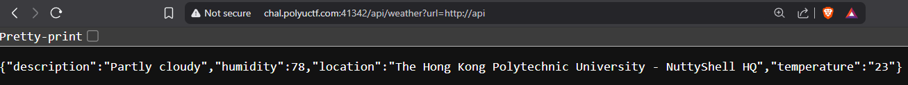
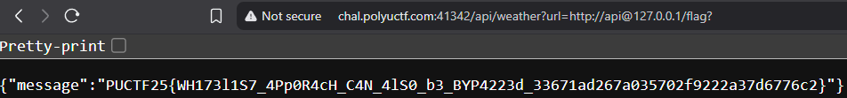

# JSON My Soul
Difficulty: ★★★★☆☆☆☆☆☆	&emsp;&emsp;&emsp;&emsp;&emsp;&emsp; Solved by: codestube (youstube_)  
  

## Details:
- Author: siunam
- Category: Web Exploitation
- Score acquired: 115

## Description:
>G'day mate, I love JSON, so much so that all the data from my internal weather API service are in JSON format!
>
>http://chal.polyuctf.com:41342
>
>[JSON-My-Soul.tar.gz](files/JSON-My-Soul.tar.gz)

## Write up:
We were given a zip file of the what I presume the API source code of [the website](http://chal.polyuctf.com:41342).  
This is the UI:  
  
  
Clicking the `Get Latest Weather Information` updates the website:  
  

At first, I have 0 clue what this does, except some API calls. Looking at burpsuite and network tab doesn't really give me any clue as to how I should tackle this problem. So I turned to the files in the folder.  
  
I opened up [the python file in api/src](files/JSON-My-Soul/api/src/app.py) and read it.
<details>
  <summary>Click to show script</summary>
  
  ```
  #!/usr/bin/env python3
  from flask import Flask, jsonify

  API_ENDPOINT = '/api/weather'

  app = Flask(__name__)

  # Hard-coded JSON data, as we don't want other third 
  # parties involve in this challenge.
  WEATHER_INFORMATION = {
      'location': 'The Hong Kong Polytechnic University - NuttyShell HQ',
      'description': 'Partly cloudy',
      'temperature': '23',
      'humidity': 78,
  }

  @app.route(API_ENDPOINT, methods=['GET'])
  def getWeatherInformation():
      return jsonify(WEATHER_INFORMATION)

  if __name__ == '__main__':
      app.run('0.0.0.0', port=80, debug=False)
  ```
</details>

So this basically shows what I just saw when clicking the button. Hmm.. I wonder...  
What does the other one [(frontend/src/app.py)](files/JSON-My-Soul/frontend/src/app.py) tell me then?  

<details>
  <summary>Click to show script</summary>
  
  ```
  #!/usr/bin/env python3
  import os
  import requests
  from flask import Flask, render_template, request, jsonify

  FLAG = os.environ.get('FLAG', 'PUCTF25{fake_flag_do_not_submit}')
  WHITELIST_API_URL = os.environ.get('WHITELIST_API_URL', 'http://api')

  API_ENDPOINT = '/api/weather'
  LOCALHOST_IP_ADDRESS = '127.0.0.1'

  app = Flask(__name__)

  @app.route('/', methods=['GET'])
  def index():
      return render_template('index.html', WHITELIST_API_URL=WHITELIST_API_URL)

  @app.route(API_ENDPOINT, methods=['GET'])
  def getWeatherInformation():
      url = request.args.get('url', WHITELIST_API_URL).lower().strip()
      if not url:
          return jsonify({'message': 'Please provide a URL.'})
      if not url.startswith(WHITELIST_API_URL):
          return jsonify({'message': 'Invalid API URL.'})

      try:
          apiResponse = requests.get(f'{url}{API_ENDPOINT}', allow_redirects=False)
          apiJsonData = apiResponse.json()
      except:
          return jsonify({'message': 'Something went wrong with the API service. Sorry!'})

      return apiJsonData

  @app.route('/flag', methods=['GET'])
  def getFlag():
      isClientAddressLocalhost = True if request.remote_addr == LOCALHOST_IP_ADDRESS else False
      if not isClientAddressLocalhost:
          return jsonify({'message': 'Try harder :D'})
      
      return jsonify({'message': FLAG})

  if __name__ == '__main__':
      app.run('0.0.0.0', port=80, debug=False)
  ```
</details>

FLAG! MONKEY SEE FLAG, MONKEY HAPPI! <sub>HUHUHAHA</sub>  
Now the question is, how do we get there..

## My understanding:
While this frontend app.py seem complicated (I have yet learn flask or request in python), one thing is for certain, which is the function getFlag():
```
def getFlag():
    isClientAddressLocalhost = True if request.remote_addr == LOCALHOST_IP_ADDRESS else False
    if not isClientAddressLocalhost:
        return jsonify({'message': 'Try harder :D'})
    
    return jsonify({'message': FLAG})
```
My understanding of this is:
```
function getFlag():
    if clients.ip != localhost(which is 127.0.0.1):
        then tell them "Try harder :D"
    else
        give them the FLAG
```
But how do we change our IP to their server's localhost? that's not possible, right?  
Let's go back and read into the app.py, where we see this:
```
def getWeatherInformation():
    url = request.args.get('url', WHITELIST_API_URL).lower().strip()
    if not url:
        return jsonify({'message': 'Please provide a URL.'})
    if not url.startswith(WHITELIST_API_URL):
        return jsonify({'message': 'Invalid API URL.'})

    try:
        apiResponse = requests.get(f'{url}{API_ENDPOINT}', allow_redirects=False)
        apiJsonData = apiResponse.json()
    except:
        return jsonify({'message': 'Something went wrong with the API service. Sorry!'})

    return apiJsonData
```
- This is a function to get weather information when the button is pressed.
- The url has to start with `WHITELIST_API_URL`, which is `http://api` by default.
- The server uses the API endpoint `/api/weather` to send a request and get the JSON of `apiResponse`
    
This is all normal, except for 1 line. `if not url.startswith(WHITELIST_API_URL):`.  
This is prone to a vulnerability called **Server-Side Request Forgery**, or **SSRF**.  
  
<details>
    <summary> Click to read what SSRF is </summary>
    <h2>A quick run down of what SSRF is:</h2>
    It manipulates a server into making requests to unintended location and accessing internal service.<br><br>
    It happens when an application or website allows users to provide URLS to be used by the server to make requests. When sending a malicious URL to the server, the server will unknowingly follows thorough with the request, and potentially reveal those resources that were not intended to be accessible to the public.<br><br>
    Examples include but not limited to accessing internal databases, reading server configuration (what we're doing now), connecting to internal service (also what we're doing now), and bypassing firewalls.
</details>
So, now, lets dive right in. <sub>vwoop!</sub>

## My Solution:
I tried getting the flag without SSRF, to test my assumption, which would be [`http://chal.polyuctf.com:41342/flag`](http://chal.polyuctf.com:41342/flag)  
  
  
Since the endpoint for the requesting `apiResponse` is `/api/weather`, I'll send the payload from that.  
What the payload currently is: [`chal.polyuctf.com:41342/api/weather`](chal.polyuctf.com:41342/api/weather), which just returns the weather information.  
  

Now, the URL request **MUST** start with ``http://api`` (`if not url.startswith(WHITELIST_API_URL)`).  
So, I'll add a `?url=http://api` at the end of my payload, and see if it still returns weather information.  
  
  
Now all I have to do is access the localhost of the API URL.  
Since it only check the start of the url (``if not url.startswith(WHITELIST_API_URL)``), by adding `@127.0.0.1` after ``http://api``, this would still return the weather information as it is still a valid API URL.  
[`chal.polyuctf.com:41342/api/weather?url=http://api@127.0.0.1`](chal.polyuctf.com:41342/api/weather?url=http://api@127.0.0.1)

Then to get the flag, simply get it the same way I did above. `/flag`  
I'll skip the testing part and just go straight to querying the flag as "localhost" with a `?` at the end.  
Therefore the final payload should be [`chal.polyuctf.com:41342/api/weather?url=http://api@127.0.0.1/flag?`](chal.polyuctf.com:41342/api/weather?url=http://api@127.0.0.1/flag?).  
  
  

And would you look at that. The flag is right here.  
`{"message":"PUCTF25{WH173l1S7_4Pp0R4cH_C4N_4lS0_b3_BYP4223d_33671ad267a035702f9222a37d6776c2}"}`

## Conclusion:
This was a fun challenge, considering I have not yet learn anything flask and request in python. This challenge made me learn more about different ways to exploit a some-what vulnerable website with SSRF, and alerted me on ways to prevent this when making my own website in the future. Although I kinda asked AI on how the SSRF payload should look like (mind you that I dont have much experience on exploiting website), I still learn a tad bit from this and that's all that matters. :>

## Shoutout:
- NuttyShell (The organizer)
- [Siunam](https://siunam321.github.io/) (The **GOATED** author)
- ChatGPT (was it o4-mini-high? or 4o.. I forgor 💀)
- owo, Bill, Karim (My teammates)

<br>
<sub>
	Tags: HTTP, Python, Flask, Web, Exploitation, SSRF, URL Manipulation, localhost, API, PUCTF, 2025
</sub>