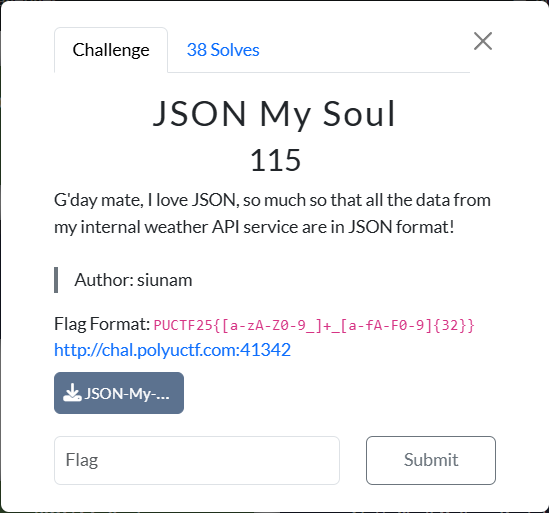
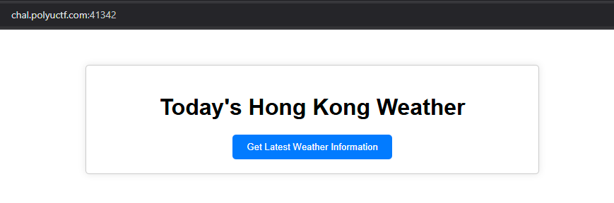
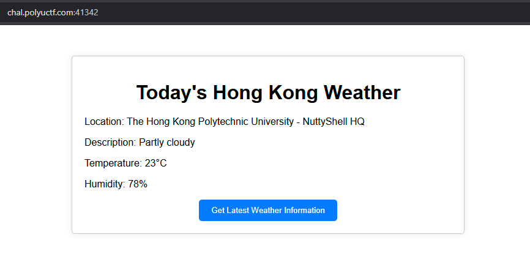

# JSON My Soul
Difficulty: ★★★★☆☆☆☆☆☆	&emsp;&emsp;&emsp;&emsp;&emsp;&emsp; Solved by: codestube (youstube_)  
  

## Details:
- Author: siunam
- Category: Web Exploitation
- Score acquired: 115

## Description:
>G'day mate, I love JSON, so much so that all the data from my internal weather API service are in JSON format!
>
>http://chal.polyuctf.com:41342
>
>[JSON-My-Soul.tar.gz](files/JSON-My-Soul.tar.gz)

## Write up:
We were given a zip file of the what I presume the API source code of [the website](http://chal.polyuctf.com:41342).  
This is the UI:  
  
  
Clicking the `Get Latest Weather Information` updates the website:  
  

At first, I have 0 clue what this does, except some API calls. Looking at burpsuite and network tab doesn't really give me any clue as to how I should tackle this problem. So I turned to the files in the folder.  
  
I opened up [the python file in api/src](files/JSON-My-Soul/api/src/app.py) and read it.
<details>
  <summary>Click to show script</summary>
  
  ```
  #!/usr/bin/env python3
  from flask import Flask, jsonify

  API_ENDPOINT = '/api/weather'

  app = Flask(__name__)

  # Hard-coded JSON data, as we don't want other third 
  # parties involve in this challenge.
  WEATHER_INFORMATION = {
      'location': 'The Hong Kong Polytechnic University - NuttyShell HQ',
      'description': 'Partly cloudy',
      'temperature': '23',
      'humidity': 78,
  }

  @app.route(API_ENDPOINT, methods=['GET'])
  def getWeatherInformation():
      return jsonify(WEATHER_INFORMATION)

  if __name__ == '__main__':
      app.run('0.0.0.0', port=80, debug=False)
  ```
</details>

So this basically shows what I just saw when clicking the button. Hmm.. I wonder...  
What does the other one [(frontend/src/app.py)](files/JSON-My-Soul/frontend/src/app.py) tell me then?  

<details>
  <summary>Click to show script</summary>
  
  ```
  #!/usr/bin/env python3
  import os
  import requests
  from flask import Flask, render_template, request, jsonify

  FLAG = os.environ.get('FLAG', 'PUCTF25{fake_flag_do_not_submit}')
  WHITELIST_API_URL = os.environ.get('WHITELIST_API_URL', 'http://api')

  API_ENDPOINT = '/api/weather'
  LOCALHOST_IP_ADDRESS = '127.0.0.1'

  app = Flask(__name__)

  @app.route('/', methods=['GET'])
  def index():
      return render_template('index.html', WHITELIST_API_URL=WHITELIST_API_URL)

  @app.route(API_ENDPOINT, methods=['GET'])
  def getWeatherInformation():
      url = request.args.get('url', WHITELIST_API_URL).lower().strip()
      if not url:
          return jsonify({'message': 'Please provide a URL.'})
      if not url.startswith(WHITELIST_API_URL):
          return jsonify({'message': 'Invalid API URL.'})

      try:
          apiResponse = requests.get(f'{url}{API_ENDPOINT}', allow_redirects=False)
          apiJsonData = apiResponse.json()
      except:
          return jsonify({'message': 'Something went wrong with the API service. Sorry!'})

      return apiJsonData

  @app.route('/flag', methods=['GET'])
  def getFlag():
      isClientAddressLocalhost = True if request.remote_addr == LOCALHOST_IP_ADDRESS else False
      if not isClientAddressLocalhost:
          return jsonify({'message': 'Try harder :D'})
      
      return jsonify({'message': FLAG})

  if __name__ == '__main__':
      app.run('0.0.0.0', port=80, debug=False)
  ```
</details>

FLAG! MONKEY SEE FLAG, MONKEY HAPPI! <sub>HUHUHAHA</sub>  
Now the question is, how do we get there..

## My solution:
While this frontend app.py seem complicated (I have yet learn flask or request in python), one thing is for certain, which is the function getFlag():
```
def getFlag():
    isClientAddressLocalhost = True if request.remote_addr == LOCALHOST_IP_ADDRESS else False
    if not isClientAddressLocalhost:
        return jsonify({'message': 'Try harder :D'})
    
    return jsonify({'message': FLAG})
```
My understanding of this is:
```
function getFlag():
    if clients.ip != localhost(which is 127.0.0.1):
        then tell them "Try harder :D"
    else
        give them the FLAG
```
But how do we change our IP to their server's localhost? that's not possible, right?  
Well, since this is an API call, meaning when we are getting the weather, we are pulling the data from an API link, which is `http://chal.polyuctf.com:41342/api/weather`  
