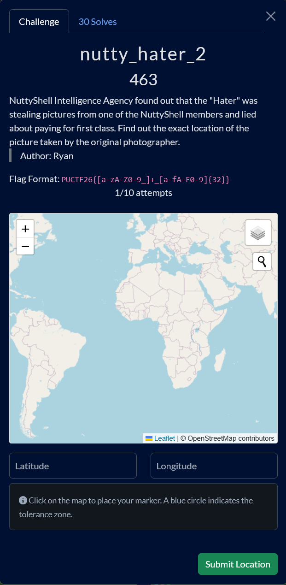
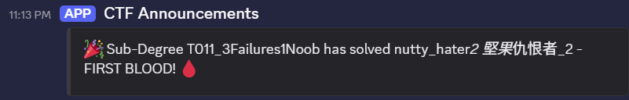

# nutty_hater_2

Difficulty: ★★★★★★★★☆☆ &emsp;&emsp;&emsp;&emsp;&emsp;&emsp; Solved by: youstube_, akitenten  

## Details

- Author: Ryan
- Category: OSINT
- Score acquired: 463 (30 Solves)

## Description

> NuttyShell Intelligence Agency found out that the "Hater" was stealing pictures from one of the NuttyShell members and lied about paying for first class. Find out the exact location of the picture taken by the original photographer.
>
> Flag Format: `PUCTF26{[a-zA-Z0-9_]+_[a-fA-F0-9]{32}}`
why does this have flag format?

## Prelude

This is one of the harder challenge in the series, where I went down a LOT of rabbit holes trying to solve it. Luckily our non-CTF / OSINT player, akitenten, solved the mystery all by herself! So this write-up is dedicated to her! Thanks for solving this with me :fire:

## Write up

We were given a discription about the hater (nuttychud)

## My understanding

WIP

## My Solution

WIP

## Conclusion

WIP

## Shoutout

- WIP

 

 Tags: WIP

