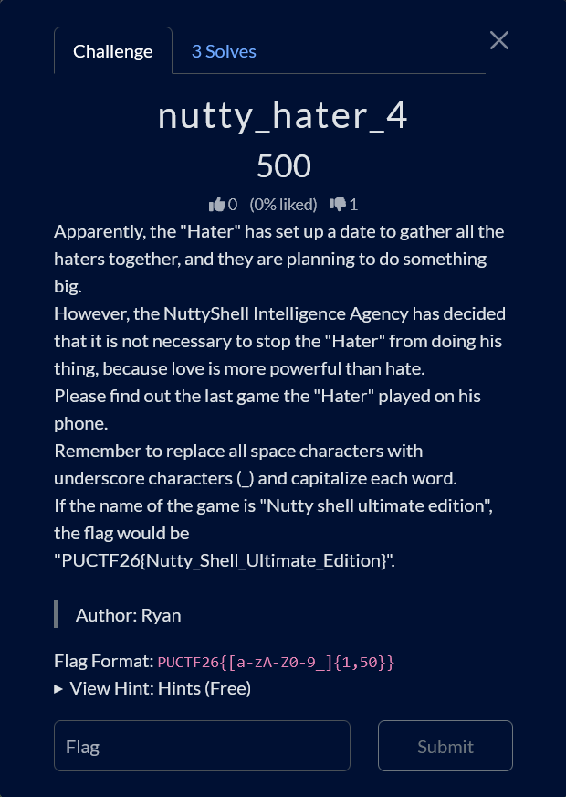

# nutty_hater_4

Difficulty: ★★★★★★★☆☆☆ &emsp;&emsp;&emsp;&emsp;&emsp;&emsp;&emsp;&emsp; Didn't solve
  

## Details

- Author: Ryan
- Category: OSINT
- Score: 500 (3 Solves)

## Description

> Apparently, the "Hater" has set up a date to gather all the haters together, and they are planning to do something big.  
> However, the NuttyShell Intelligence Agency has decided that it is not necessary to stop the "Hater" from doing his thing, because love is more powerful than hate.  
> Please find out the last game the "Hater" played on his phone.  
> Remember to replace all space characters with underscore characters (_) and capitalize each word.  
> If the name of the game is "Nutty shell ultimate edition", the flag would be "PUCTF26{Nutty_Shell_Ultimate_Edition}".
>
> Flag Format: `PUCTF26{[a-zA-Z0-9_]{1,50}}`  

  
View hint:

  The name of the game account in nutty_hater_4 is changed to reflect the email.

## Write up

WIP

## My understanding

WIP

## My Solution

WIP

## Conclusion

WIP

## Shoutout

- WIP

 

 Tags: WIP

